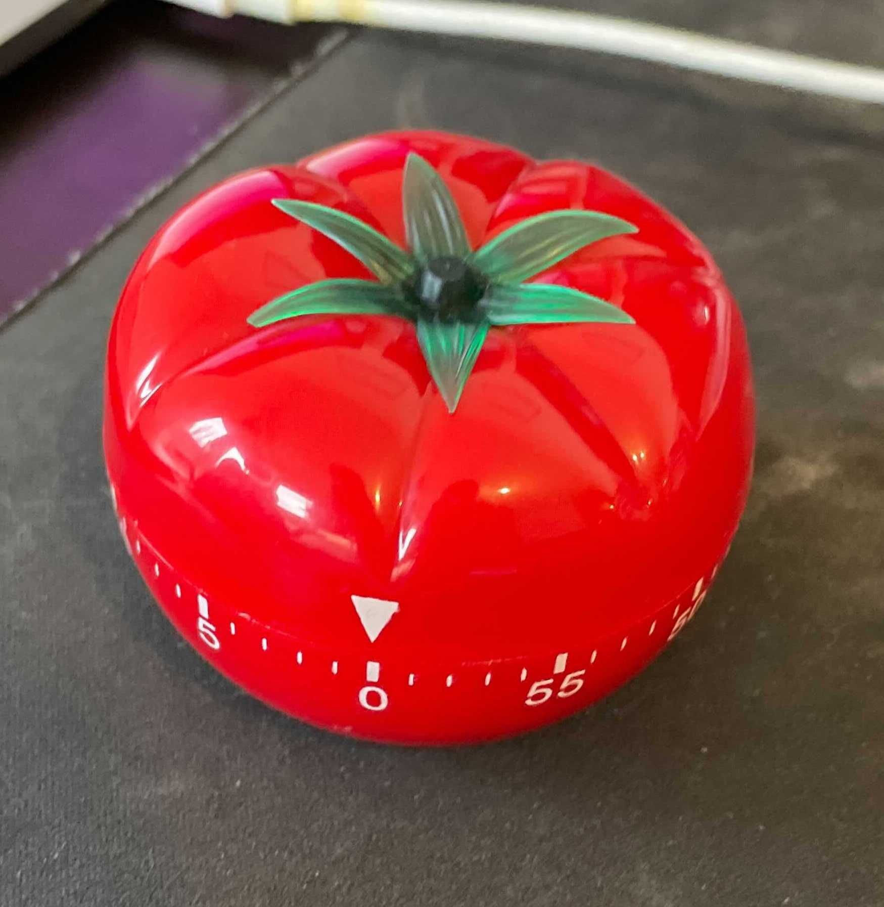

# `tomato`

Install: `go get github.com/CGA1123/tomato`

There are a couple of subcommands:

- `help`: prints usage information
- `start`: starts a 25min tomato timer
- `stop`: stops the currently running timer
- `remaining`: returns how many minutes there are left on the timer
- `running`: returns exit code `33` if the timer is not running, `0` otherwise
- `server`: starts the tomato server
- `kill`: kills the tomato server
- `up`: returns exit code `33` if the tomato server is not up, `0` otherwise

## How it works

`tomato server` starts an RPC server over `unix` sockets using
`/tmp/tomato.sock`, most other `tomato` commands then make requests to this
server.

Server logs are outputted to `/tmp/tomato.log`, logs are truncated across
restarts.

You can use `tomato running` and check the exit code as a means to quickly
check if a tomato is running, and use that information to render something in
your editor or command line.
